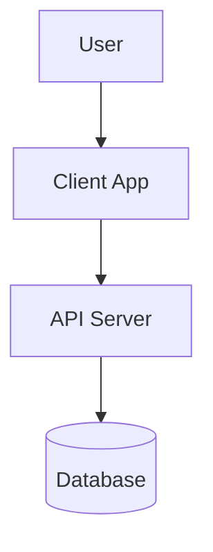

# [Project Name] Design Doc

> Status: [Draft | In Review | Approved]
>
> Authors: [Names]
>
> Last Updated: [Date]

## 1. Context & Scope

### 1.1 Goal
*Briefly describe **what** we are building and **why**. focus on the business value or user problem being solved.*

### 1.2 User Stories / Use Cases
*   **User Story 1**: As a [user role], I want to [action], so that [benefit].
*   **User Story 2**: ...

### 1.3 Out of Scope
*   *What we are explicitly NOT doing in this iteration.*

---

## 2. System Architecture

### 2.1 High-Level Diagram
*Describe the high-level data flow or component interaction. You can use a Mermaid diagram here.*



### 2.2 Component Breakdown
*   **Component A**: *Responsibility...*
*   **Component B**: *Responsibility...*

---

## 3. Functional Specifications (The "What")
*Detailed description of system behavior from a user or external perspective.*

### 3.1 [Feature Name]
*   **Behavior**: *How should it behave?*
*   **Inputs**: *What data does the user provide?*
*   **Outputs**: *What does the system show or return?*
*   **Edge Cases**:
    *   *What happens on error?*
    *   *Empty states?*

---

## 4. Technical Specifications (The "How")
*Implementation details for engineers and AI agents.*

### 4.1 API Design
*Define endpoints, request/response bodies.*
*   `GET /resource`: Returns list of resources.
*   `POST /resource`: Creates a new resource.

### 4.2 Data Models / Schema
*Database schema or data structures.*

```typescript
interface User {
  id: string;
  name: string;
  email: string;
}
```

### 4.3 Algorithms / Logic
*Specific logic rules or pseudo-code.*

---

## 5. Verification Plan

### 5.1 Automated Tests
*   [ ] Unit tests for [Component]
*   [ ] Integration tests for [Flow]

### 5.2 Manual Verification
*   [ ] Step 1: ...
*   [ ] Step 2: ...

---

## 6. Task Breakdown
*Detailed checklist for implementation. Use this to track progress.*

- [ ] **Phase 1: Setup & Core**
    - [ ] Initialize project
    - [ ] Setup database
- [ ] **Phase 2: [Feature A]**
    - [ ] Implement API
    - [ ] Implement UI
- [ ] **Phase 3: Polish**
    - [ ] Error handling
    - [ ] Styling
